# Setup

## About Claude Code

Claude is a large language model (LLM) developed by Anthropic. "Claude code" refers to code that utilizes Claude for AI programming or building AI agents.

### Features of Claude
- Advanced natural language understanding and generation
- Excellent at handling long context and documents
- Designed with a focus on safety and ethics

### Use Cases for Claude Code
- Building chatbots and AI assistants
- Text summarization, translation, and question answering systems
- Automating code generation, review, and documentation


### Usability and Recommended Reasons for Claude Code

Claude code is known for its ease of use and developer-friendly experience. The API is well-documented, and SDKs are available for popular programming languages, making integration straightforward. Claude's natural language capabilities allow developers to interact with the model using simple, intuitive prompts, reducing the need for complex engineering or prompt design.

#### Why Use Claude Code?
- **Accessible for Non-Developers:** Claude code is designed so that even people without deep programming knowledge can easily build AI-powered applications. Its natural language interface and simple API allow users to create powerful solutions with minimal technical background.
- **High-Quality Output:** Claude provides accurate, context-aware, and coherent responses, even for complex or nuanced queries.
- **Long Context Handling:** It can process and generate long documents or conversations, making it suitable for advanced applications.
- **Safety and Reliability:** Anthropic places a strong emphasis on safety, minimizing harmful or biased outputs and ensuring ethical AI use.
- **Flexible Integration:** Claude code can be easily embedded into various products, from chatbots to automation tools, with minimal setup.
- **Continuous Improvement:** Anthropic regularly updates Claude with new features and improvements, ensuring access to state-of-the-art AI capabilities.

For these reasons, Claude code is highly recommended for not only developers and organizations, but also for individuals without programming expertise who want to create robust, safe, and high-performing AI solutions.

## Getting Started with Claude
### Cloude Account Creation and API Key Acquisition
1. Send your email address to the instructor.
2. Click "Accept invitation" in the email you receive.
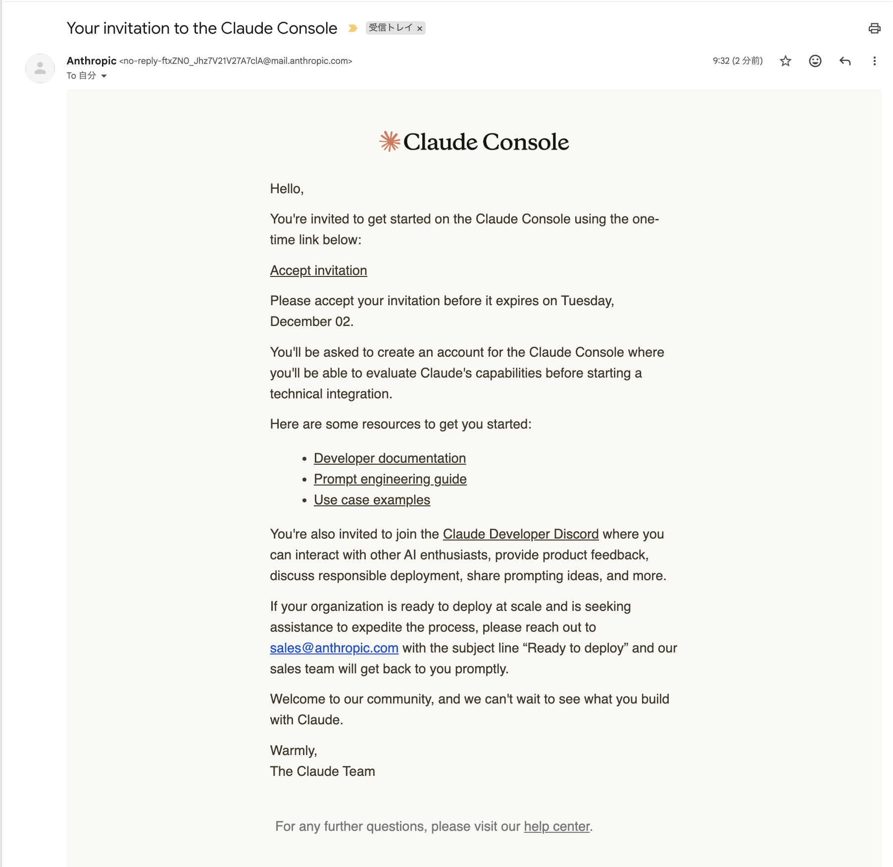
3. Complete the required information during authentication and onboarding.
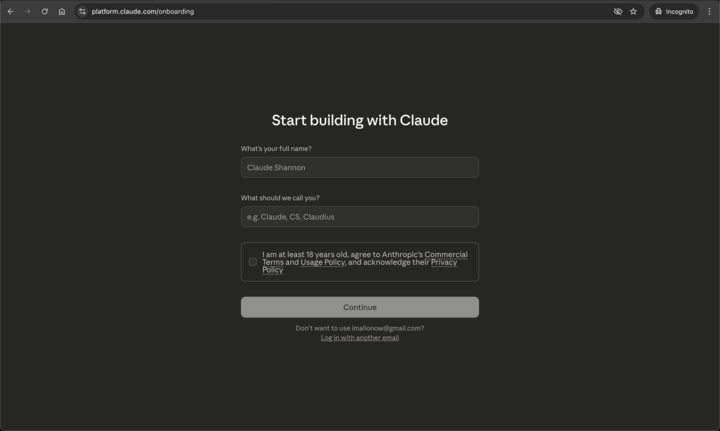
4. After onboarding, when the dashboard appears, click "Get API Key".

5. click "CreateKey" button
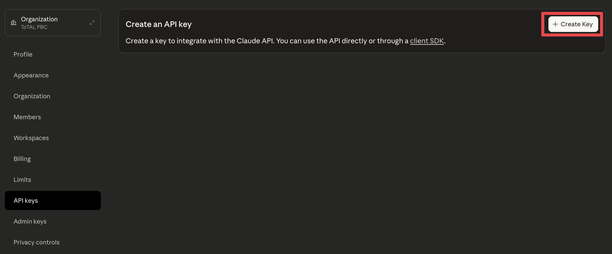
6. When the API key creation screen appears,
- select "Learning Phase#3" from the "Workspace" dropdown.
- enter "Name your key" field. ex: "pbc-phase3-Key"
- click "Add" button
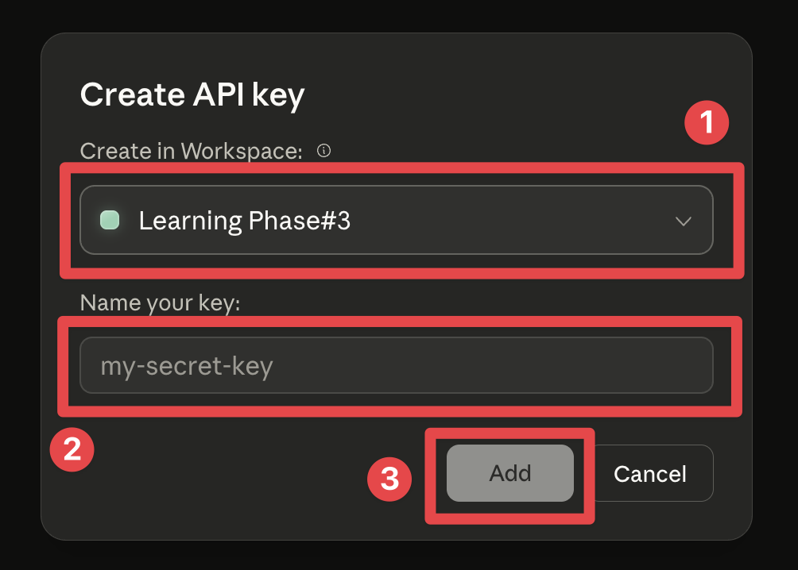
7. Save your API key
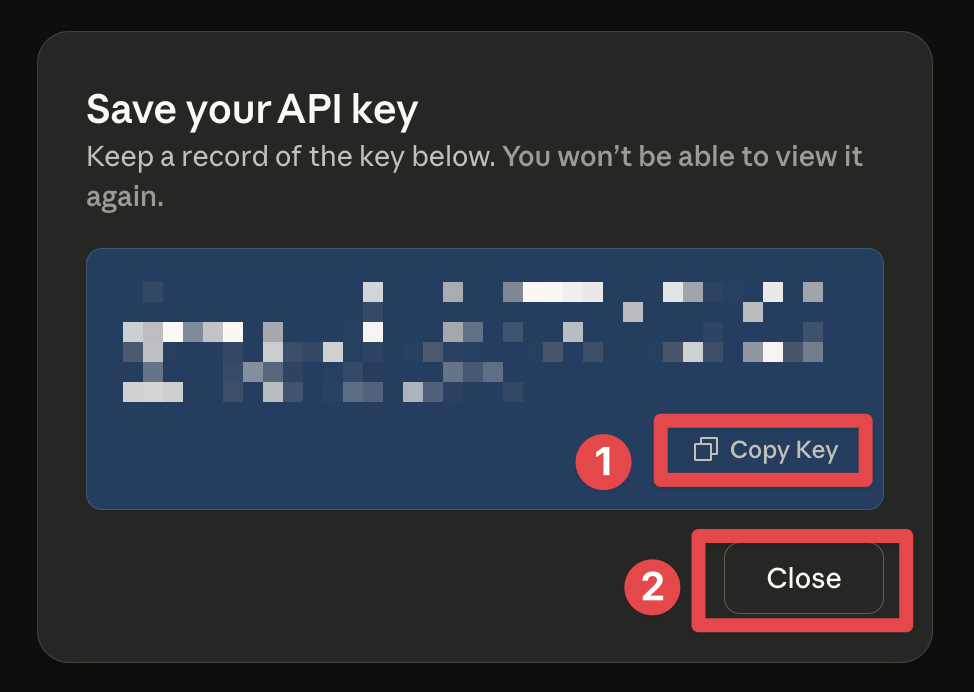
8. If you see a screen like this, you have successfully completed the setup.
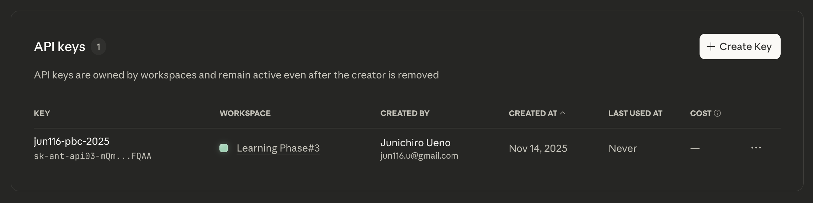

### Using Claude Code in Your VS Code
1. Open VS Code.
2. Click the Extensions icon on the left sidebar.
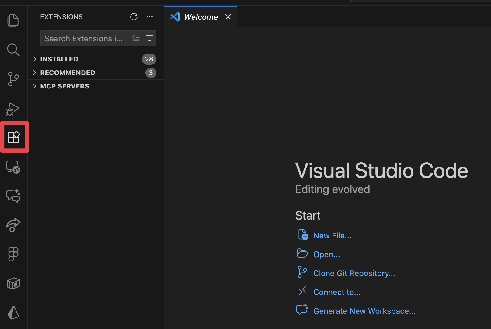
3. Search for "Claude" in the Extensions Marketplace.
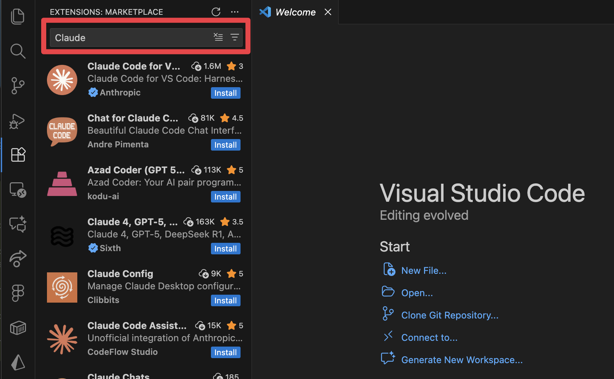
4. Find the "Claude Code for VS Code" extension by Anthropic and click "Install".
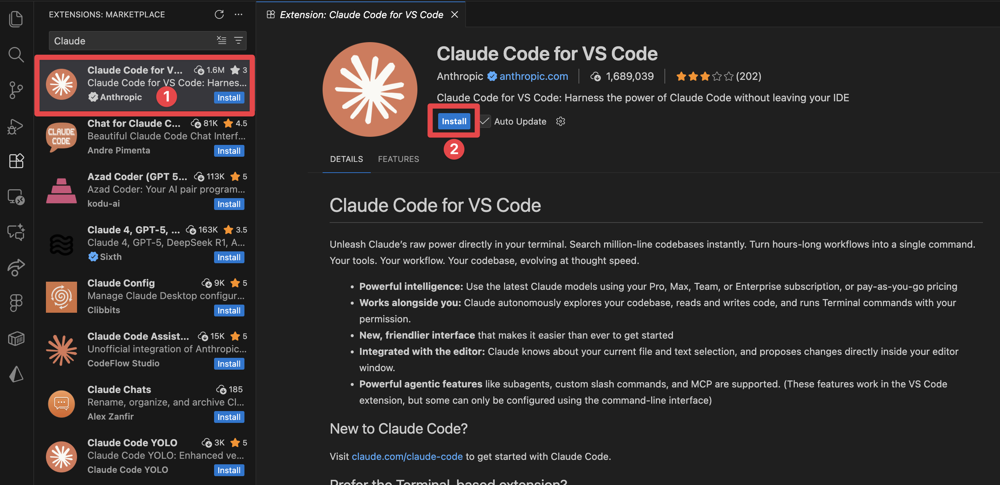
5. click "Trust Publisher & Install" button.
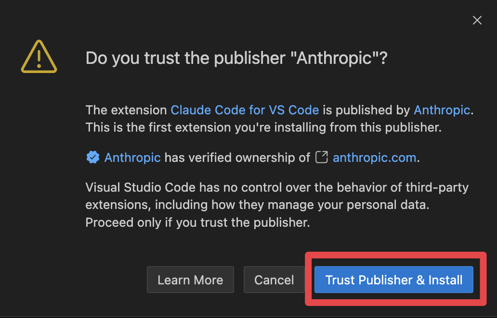
6. Click "Open Folder" and select your project folder. 
- Please create a folder for this project. ex: isct2025-learning-phase3
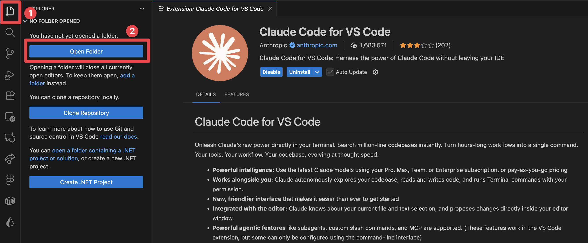
7. Open Terminal.
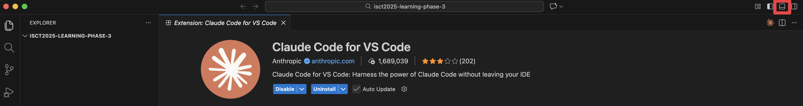
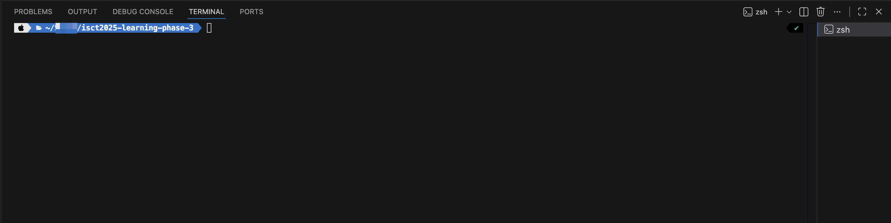

### To install Claude Code

#### Mac

1. enter the following command in your terminal:
```bash
> curl -fsSL https://claude.ai/install.sh | bash
```
```bash
Setting up Claude Code...

✔ Claude Code successfully installed!

  Version: 2.0.37

  Location: ~/.local/bin/claude


  Next: Run claude --help to get started

⚠ Setup notes:
  • Native installation exists but ~/.local/bin is not in your PATH. Run:

  echo 'export PATH="$HOME/.local/bin:$PATH"' >> ~/.zshrc && source ~/.zshrc


✅ Installation complete!
```
2. if you see a message like the one above indicating that `~/.local/bin` is not in your PATH, run the following command to add it:
```bash
echo 'export PATH="$HOME/.local/bin:$PATH"' >> ~/.zshrc && source ~/.zshrc
```

#### Windows
1. Open PowerShell as Administrator.
2. enter the following command:
```powershell
irm https://claude.ai/install.ps1 | iex
```

```powershell
Setting up Claude Code...
✔ Claude Code successfully installed!

  Version: 2.0.37

  Location: C:\Users\<YourUsername>\AppData\Local\Programs\Claude Code
  Next: Run claude --help to get started
⚠ Setup notes:
  • Native installation exists but C:\Users\<YourUsername>\AppData\Local\Programs\Claude Code is not in your PATH. To add it, run: 
  [Environment]::SetEnvironmentVariable("Path", $env:Path + ";C:\Users\<YourUsername>\AppData\Local\Programs\Claude Code", [EnvironmentVariableTarget]::User)
✅ Installation complete!
```
3. if you see a message like the one above indicating that the installation path is not in your PATH, run the following command to add it:
```powershell
[Environment]::SetEnvironmentVariable("Path", $env:Path + ";C:\Users\<YourUsername>\AppData\Local\Programs\Claude Code", [EnvironmentVariableTarget]::User)
```

### Cloude Code Configuration

1. Open Claude Code
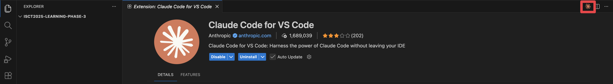
2. Click "Anthropic Console".
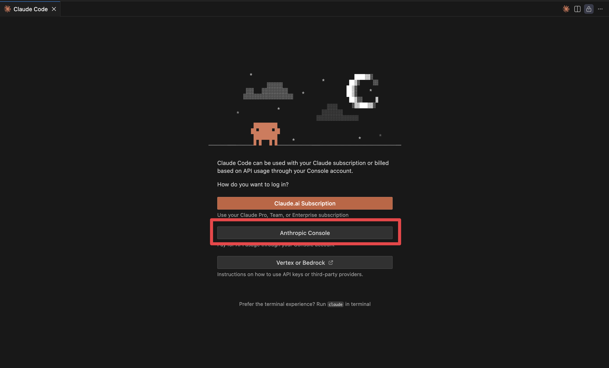
- If the screen above does not appear, please enter “/login” on the following screen.
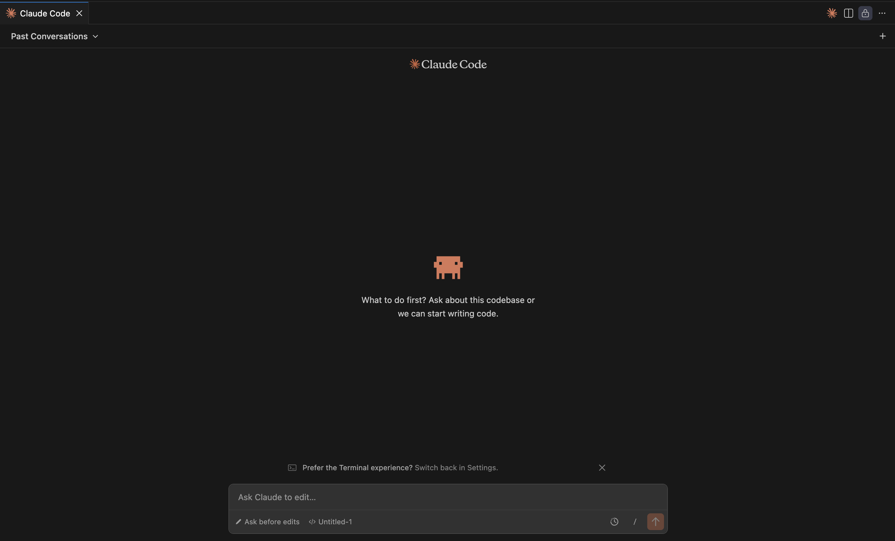
3. The browser will open, so please authenticate.
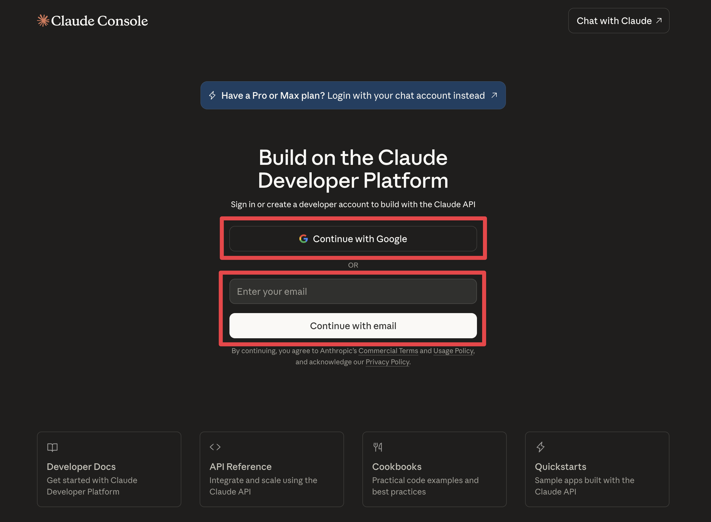
4. You will be prompted to connect to the organization, so click Authorize.

5. When this screen appears, return to VSCode.
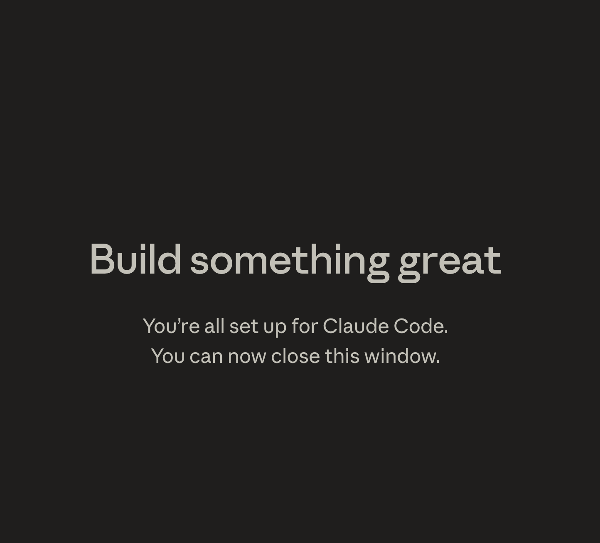
6. Finally, when this screen appears, the setup is complete.


**Navigation:**
- **Next:** [Implement using Cloude Code →](02-cloude-code.md)
