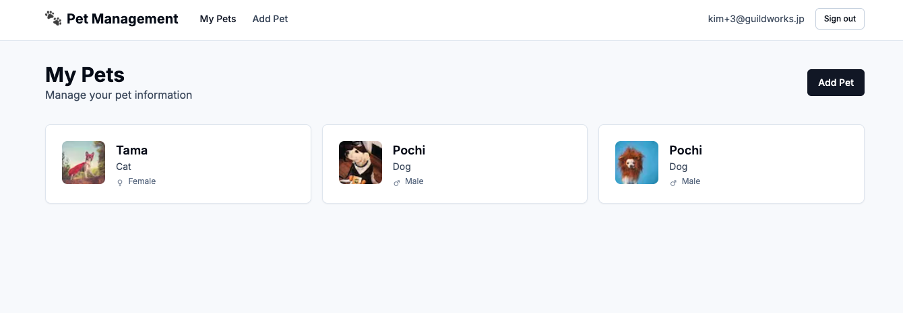
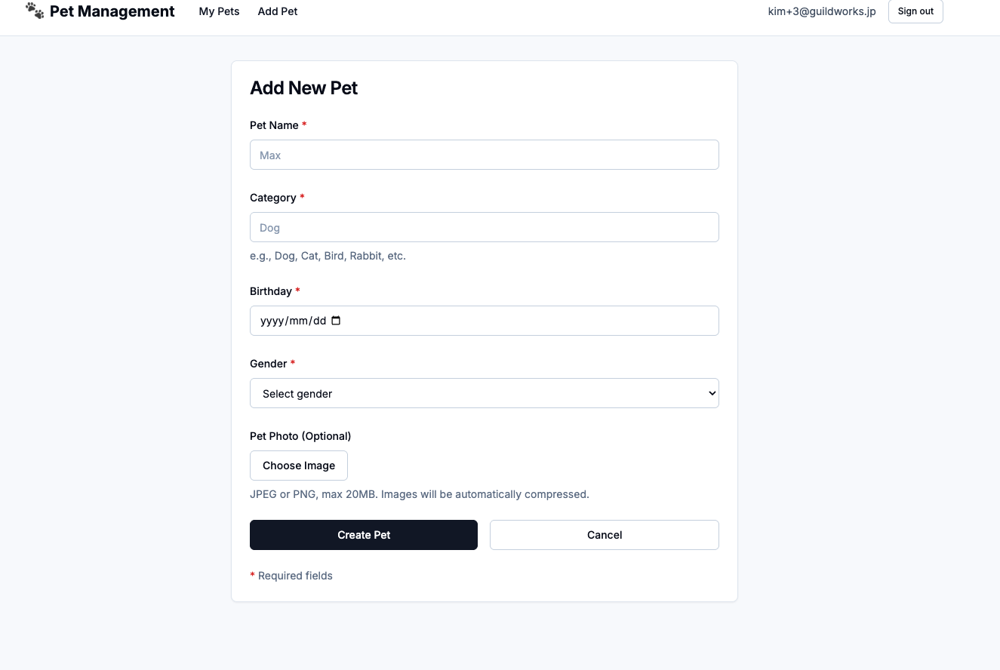
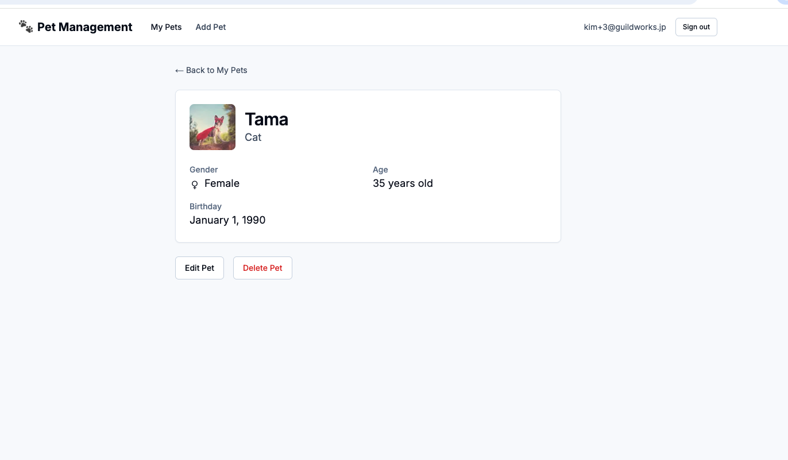

# Implement using Cloude Code

## Using Claude Code Demo
We'll demonstrate how to use Claude Code.

## Sample Application
Let's try building an application like the one in the image above using Claude Code.  
First, let's start by copying it.

## Important Notes
- If you have any questions, please call a mentor.
- If you have any good questions or insights, we'll share them with everyone.
